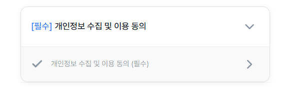

# 📜 Smart Terms UI

금융 서비스 및 일반 앱에서 공통적으로 사용되는 **약관 동의 상세 페이지**를 위한 리액트 컴포넌트 라이브러리입니다. 사용자가 약관을 끝까지 읽어야만 확인 버튼이 활성화되는 UX 로직과 AI 요약 컴포넌트를 제공합니다.

## ✨ Key Features

- **Compound Component 패턴**: 하위 컴포넌트를 조립하여 자유롭게 레이아웃을 구성할 수 있습니다.
- **드롭다운 그룹 UI**: 약관을 그룹 단위로 접고 펼칠 수 있어 깔끔하게 표현할 수 있습니다.
- **스크롤 감지 로직**: 사용자가 약관 본문을 끝까지 읽었을 때만 '확인' 버튼이 활성화됩니다.
- **상세 약관 확인 기반 체크 활성화**: 사용자가 약관 상세 페이지에서 확인 버튼을 눌러야 해당 약관의 체크 상태가 활성화됩니다. 
- **AI 요약 레이아웃**: 복잡한 약관을 한눈에 파악할 수 있는 AI 요약 전용 배지 및 텍스트 레이아웃을 제공합니다.
- **디자인 커스터마이징**: CSS 변수(`--st-primary` 등)를 통해 브랜드 컬러를 쉽게 변경할 수 있습니다.

## 📦 Installation

```bash
npm install smart-terms-ui
```

## 🛠 Component - Agreement

### Agreement
약관 동의 전체를 감싸는 컨테이너 컴포넌트입니다.

### Agreement.Group
드롭다운 형태의 약관 그룹 컴포넌트입니다.

| Prop | Type | Description | Default |
| :--- | :--- | :--- | :--- |
| `title` | `string \| ReactNode` | 그룹 제목 | - |
| `isOpen` | `boolean` | 드롭다운 열림 여부 | `false` |
| `onToggle` | `function` | 헤더 클릭 시 실행되는 콜백 | - |

### Agreement.Row
개별 약관 항목을 나타내는 컴포넌트입니다.

| Prop | Type | Description | Default |
| :--- | :--- | :--- | :--- |
| `isChecked` | `boolean` | 체크박스 선택 여부 | `false` |
| `onCheck` | `function` | 체크박스 변경 시 실행되는 콜백 | - |
| `onGoDetail` | `function` | 우측 화살표 클릭 시 실행되는 콜백 | - |

### Agreement.Text
약관 텍스트를 표시하는 컴포넌트입니다.

### Agreement.CheckBox
SVG 기반의 커스텀 체크박스 컴포넌트입니다. 

### Agreement.RightArrow
약관 상세 페이지 이동을 나타내는 화살표 아이콘 컴포넌트입니다.

---

## 🚀 사용 예시 (Agreement)


```jsx
import { Agreement } from 'smart-terms-ui'
import { useState } from 'react'

function App() {
  const [open, setOpen] = useState(true)
  const [checked, setChecked] = useState(false)

  return (
    <Agreement>
      <Agreement.Group
        title="필수 약관 동의"
        isOpen={open}
        onToggle={() => setOpen(prev => !prev)}
      >
        <Agreement.Row
          isChecked={checked}
          onCheck={() => setChecked(prev => !prev)}
          onGoDetail={() => console.log('약관 상세 이동')}
        >
          <Agreement.Text variant="large" tone="main">
            서비스 이용약관 동의 (필수)
          </Agreement.Text>
        </Agreement.Row>
      </Agreement.Group>
    </Agreement>
  )
}

## 🛠 Component - Detail

### Detail

| Prop        | Type       | Description                   | Default |
| ----------- | ---------- | ----------------------------- | ------- |
| `onConfirm` | `function` | 확인 버튼 클릭 시 실행될 콜백 | -       |

### Detail.Title

- 제목 컴포넌트

### Detail.Subtitle

- 소제목 컴포넌트

### Detail.Body

- 내용 컴포넌트

### Detail.BadgeGroup

- 배지 아이템을 래핑하는 그룹

### Detail.BadgeItem

- 불렛 포인트로 텍스트를 표시하는 컴포넌트

## 🚀 사용 예시

```jsx
import { Detail } from 'smart-terms-ui'

function App() {
  const handleConfirm = () => {
    console.log('약관 동의 완료!')
  }

  return (
    <Detail onConfirm={handleConfirm}>
      <Detail.Title>제1조 (목적)</Detail.Title>
      <Detail.Body>약관 내용입니다.</Detail.Body>

      {/* AI 요약 섹션 */}
      <Detail.BadgeGroup>
        <Detail.Subtitle>AI 요약</Detail.Subtitle>
        <Detail.BadgeItem>
          <Detail.Body>AI 요약 내용입니다.</Detail.Body>
        </Detail.BadgeItem>
      </Detail.BadgeGroup>
    </Detail>
  )
}
```
- Example Preview
<div align="center">
  
</div>

<div align="center">
  
</div>

<div align="center">
  
</div>

## 🎨 Customizing Theme

프로젝트의 전역 CSS에서 아래 변수들을 수정하여 디자인을 변경할 수 있습니다.

```css
:root {
  --st-primary: #0046ff; /* 메인 강조색 */
  --st-bg: #ffffff; /* 배경색 */
  --st-text-main: #111111; /* 기본 텍스트 색상 */
}
```
